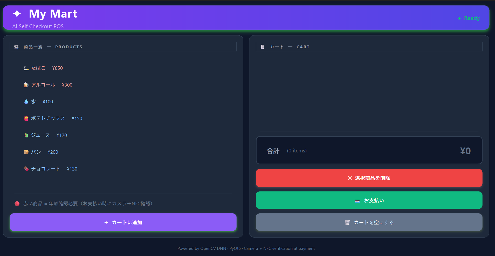
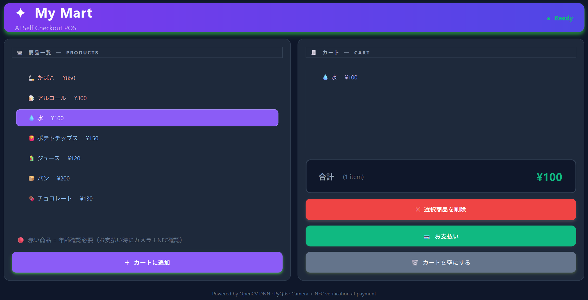
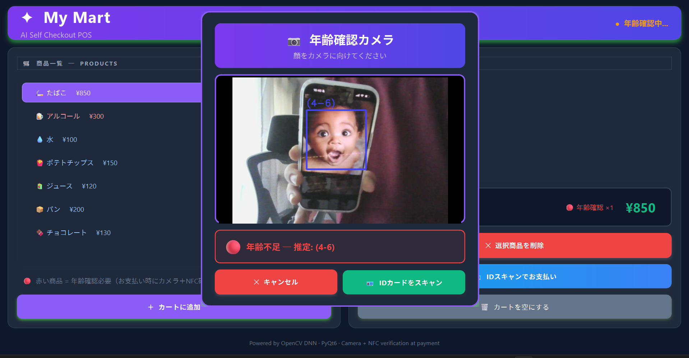
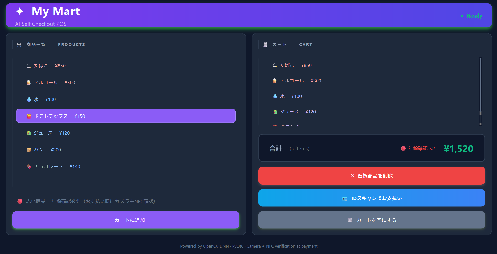

# 🧠 AI Age Verification POS System
### Smart Retail Checkout with AI Face Detection & NFC Identity Verification

An intelligent Point-of-Sale (POS) application that performs **real-time age verification** using Computer Vision and simulated NFC identity validation.  
Designed to demonstrate modern retail automation for handling age-restricted products in convenience stores and self-checkout environments.

---

## 🎯 Project Purpose

This project was developed to demonstrate:

- Real-time AI integration in desktop applications
- Computer Vision for retail automation
- Secure handling of age-restricted products
- Modern GUI development using PyQt6
- Simulation of Japanese retail checkout workflows

---

## 🚀 Key Features

- 📷 Live Camera Age Estimation
- 🧠 Deep Learning Age Classification
- 🪪 NFC ID Card Verification Simulation
- 🚬 Age Restricted Product Protection
- 🛒 Interactive POS Cart System
- 🎨 Modern Responsive PyQt6 Interface
- ⚡ Real-Time Processing with OpenCV

---

## 🧰 Technology Stack

- Python
- PyQt6
- OpenCV
- Deep Learning Age Detection Model
- Haar Cascade Face Detection
- Object-Oriented Programming (OOP)
- GUI Animation & Effects

---

## 📸 Screenshots:








---

## ⚙️ Installation:
git clone https://github.com/tamim-dev-it/ai-pos-system.git
cd ai-age-verification-pos
pip install -r requirements.txt
python main.py

---


## 📁 Project Structure

```
ai-age-verification-pos/
│
├── main.py
├── requirements.txt
├── README.md
│
├── models/
│   ├── age_net.caffemodel
│   ├── age_deploy.prototxt
│   └── haarcascade_frontalface_default.xml
│
└── screenshots/
    ├── home_screen.png
    ├── camera_verification.png
    └── nfc_scan.png
```

---

## 🔐 Age Verification Logic

1. AI detects face via camera
2. Age is estimated using Deep Learning model
3. If age < 25 → NFC ID verification required
4. If age < 20 → Restricted purchase blocked
5. If age ≥ 25 → Purchase allowed

---

## 🎓 Learning Outcomes

- AI + GUI application architecture
- Real-time video processing pipeline
- User experience design for POS systems
- Security-focused application logic
- Simulation of real-world retail workflows

---

## 📌 Future Improvements

- Real NFC hardware integration
- Cloud database for identity verification
- Payment gateway integration
- Multi-language UI support
- Product barcode scanning

---

## 👨‍💻 Author

Portfolio Project – AI + Computer Vision + Retail Automation  
Developed for Software Engineering & IT Job Applications
